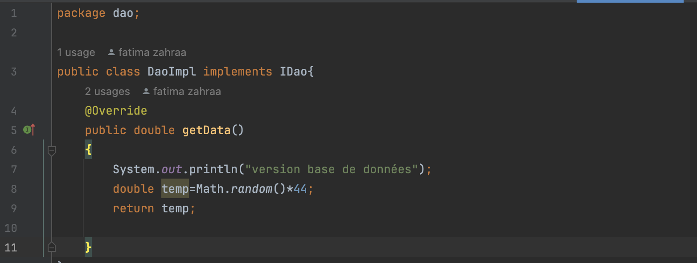
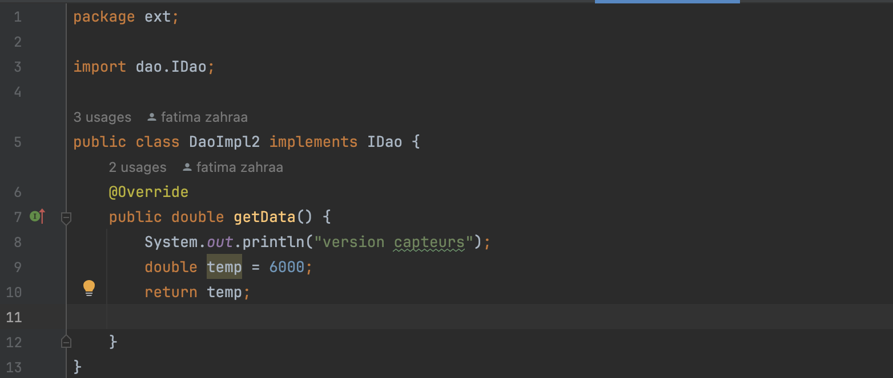
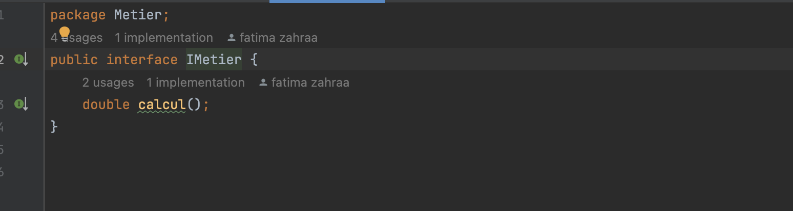
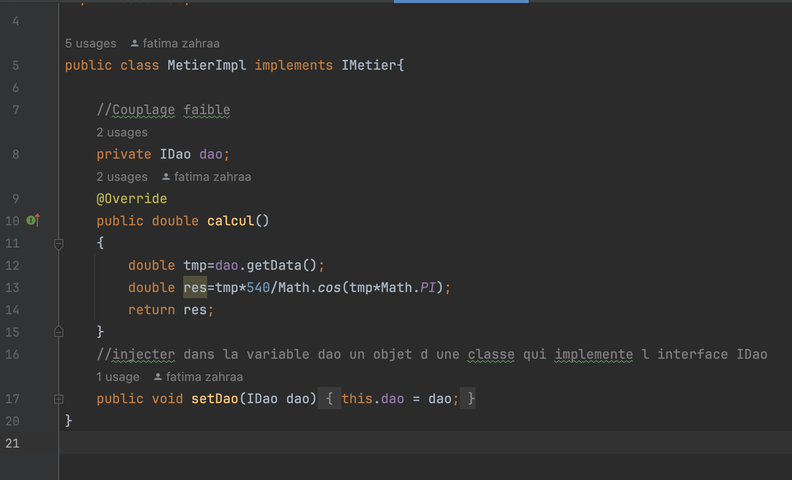
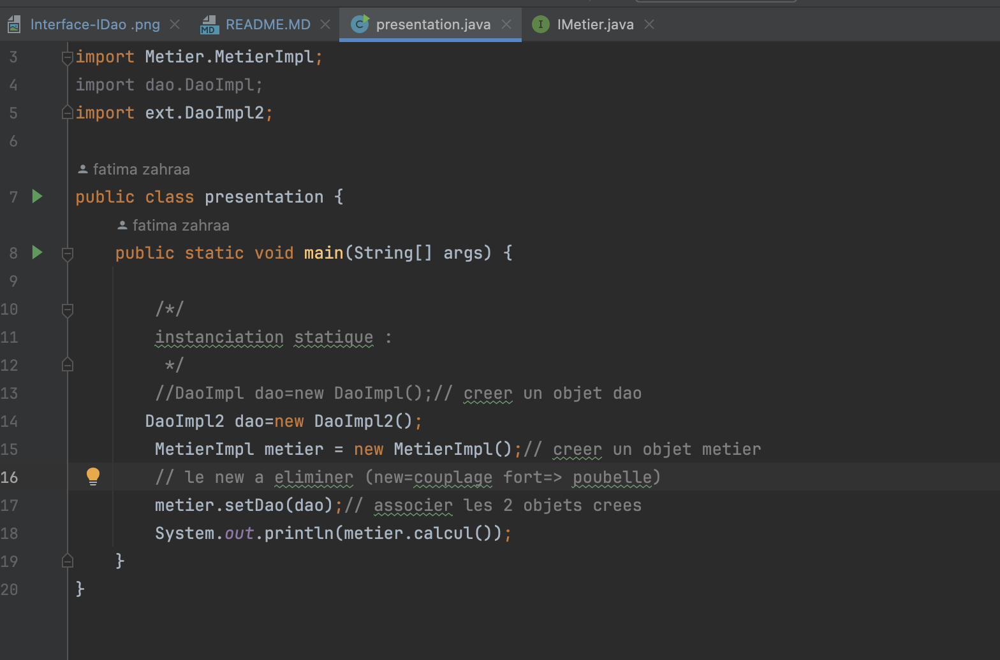
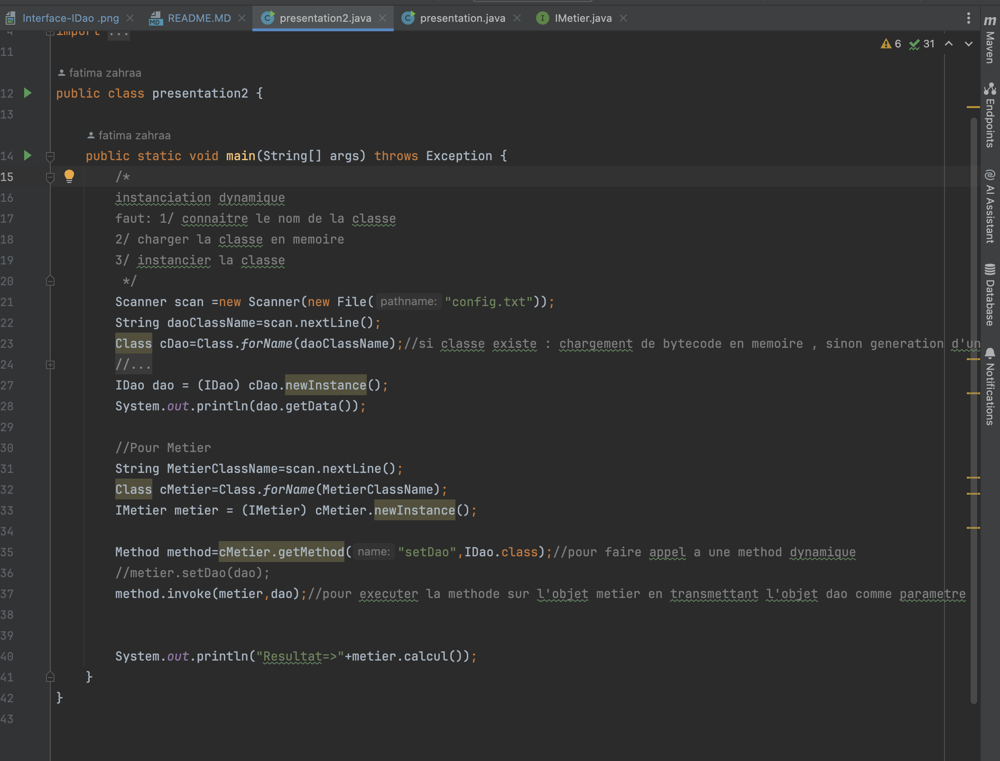

<h2>Compte Rendu Tp1</h2>
<h3>l'interface IDao avec une méthode getDate</h3>

<h3>implémentation 1 de l'interface IDao </h3>

<h3>implémentation 2 de l'interface IDao </h3>

<h3>l'interface IMetier avec une méthode calcul </h3>

<h3>implémentation de cette interface en utilisant le couplage faible</h3>

<h3> l'injection des dépendances : </h3>
<h4> - Par instanciation statique </h4>

<h4> - Par instanciation dynamique </h4>

<h4> - En utilisant le Framework Spring </h4>
<h3> Veuillez consulter projet suite de tp1 avec spring  </h3>

